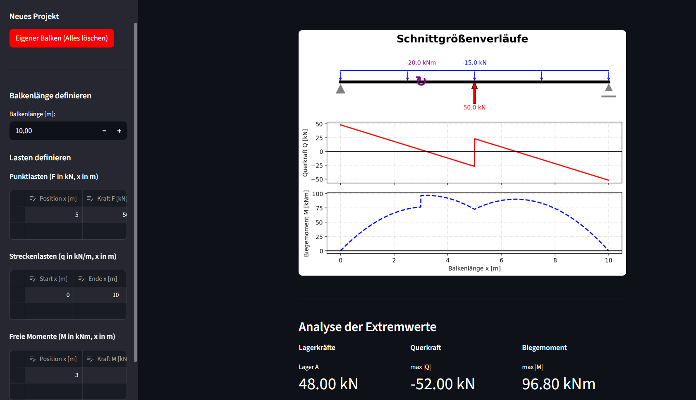

# 🏗️ Schnittgrößen-Solver

[](https://schnittgroessen-solver.streamlit.app/)

Ein interaktives Python-Tool zur statischen Berechnung und Visualisierung von Einfeldträgern. 

> **🌐 Live-Demo:** Du kannst das Programm direkt im Browser testen: [Hier klicken](https://schnittgroessen-solver.streamlit.app/)

<br>
<br>



<br>

## 📖 Projektbeschreibung
Dieses Programm berechnet die Auflagerkräfte sowie die Verläufe von Querkraft und Biegemoment für statisch bestimmte Einfeldträger. Über ein interaktives Dashboard (Streamlit) können Balkenlängen sowie beliebige Punktlasten, Streckenlasten und freie Momente definiert werden. 

Die Ergebnisse werden sofort ausgewertet und als professionelles Freikörperbild inklusive Schnittgrößendiagrammen (Matplotlib) visualisiert.

## ✨ Kernfunktionen
* **Interaktive UI:** Dynamische Eingabe von Lasten über Datentabellen. Falscheingaben (z. B. Lasten außerhalb des Balkens) werden durch Exceptions abgefangen.
* **OOP-Architektur:** Saubere Trennung von Benutzeroberfläche (`app.py`), physikalischer Berechnung (`mechanik.py`) und Grafik-Engine (`visualisierung.py`).
* **Extremwert-Analyse:** Automatische numerische Ermittlung der maximalen Schnittgrößen und deren Position am Balken.

## 📐 Theorie & Mechanische Grundlagen
Die Software basiert auf den Gleichgewichtsbedingungen der Technischen Mechanik. Die mathematische Modellierung, die Vorzeichenkonventionen sowie die angewandte Schnittufer-Logik sind im folgenden Dokument händisch dokumentiert:
👉 **[Theoretische Herleitung ansehen (PDF)](./Herleitung_Schnittgroessen.pdf)**


### 💡 Ein Blick in den Code (Defensive Programmierung & OOP)

Um die Software im Einsatz robust gegen Abstürze zu machen, ist der Code streng objektorientiert aufgebaut und fängt Falscheingaben dynamisch ab. 

Hier ein Auszug aus der `app.py`, der zeigt, wie Nutzereingaben (z. B. Lasten, die außerhalb der Balkenlänge platziert werden) durch Exception-Handling und Logikprüfungen gefiltert werden, bevor sie an die physikalische Berechnung übergeben werden:


```python
for index, row in punktlasten_eingabe_neu.iterrows():
    try:
        abstand_Punktlast = float(row["Position x [m]"])
        kraft = float(row["Kraft F [kN]"])
        
        # Validierung: Liegt die Last außerhalb der Balkenlänge?
        if abstand_Punktlast > Balken_Laenge:
            st.sidebar.error(f"Fehler in Zeile {index+1}: Position {abstand_Punktlast}m liegt außerhalb!")
            continue # Zeile überspringen, Programmabsturz verhindern
            
        # Wenn valide: Speicherung im OOP-Datenmodell
        neuer_Balken.speichere_Punktlast(abstand_Punktlast, kraft)
        
    except (ValueError, TypeError):
        # Leere oder unvollständige Tabellenzellen sicher abfangen
        pass
```

## 🚀 Ausblick & Geplante Features
* **Analytische Momentenbestimmung:** Die Extremwerte werden derzeit numerisch am diskretisierten Array (1000 Punkte) ermittelt. Für das absolute Biegemomenten-Maximum ist künftig eine analytische Nullstellensuche der Querkraftfunktion denkbar, um die exakte Position zwischen den Diskretisierungspunkten zu finden. Die Querkraftmaxima würden aufgrund der Diskontinuitäten (Sprungstellen) weiterhin robust über die numerische Array-Suche bestimmt.

## 🛠️ Verwendete Technologien
* **Python 3**
* **Streamlit** (Web-Dashboard)
* **NumPy** (Numerische Arrays)
* **Pandas** (Datenmanagement der Eingabetabellen)
* **Matplotlib** (Plotting und Diagramme)
